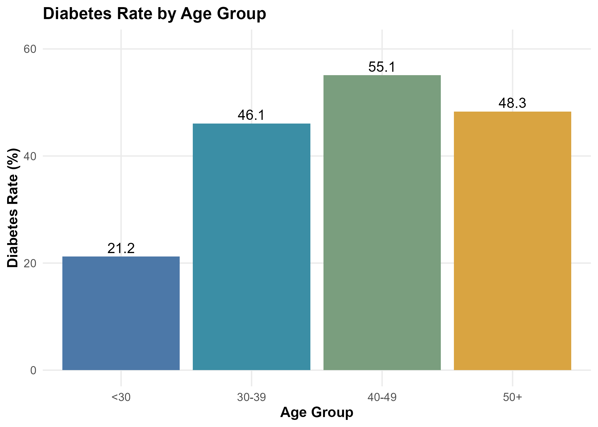
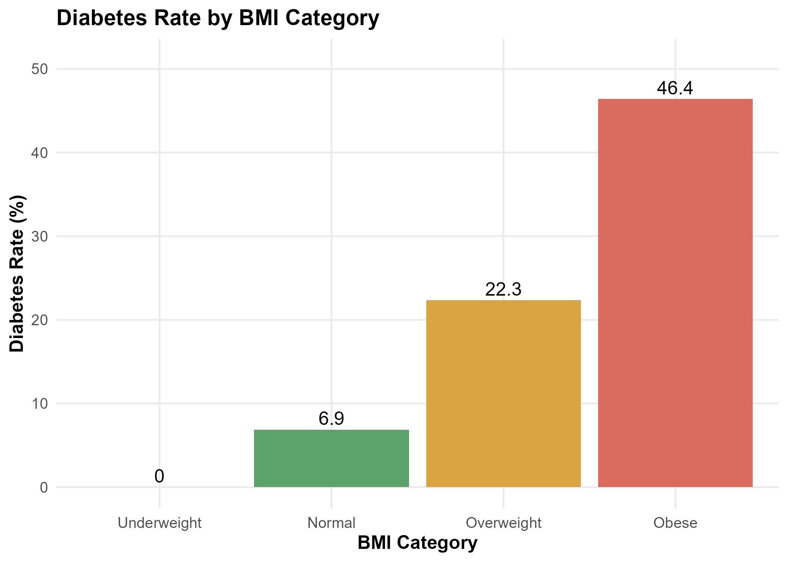
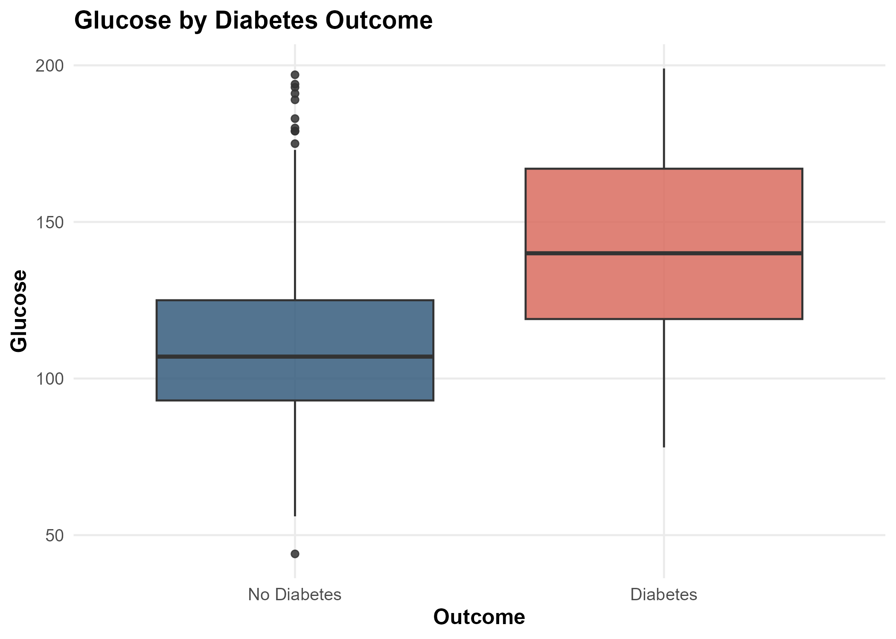
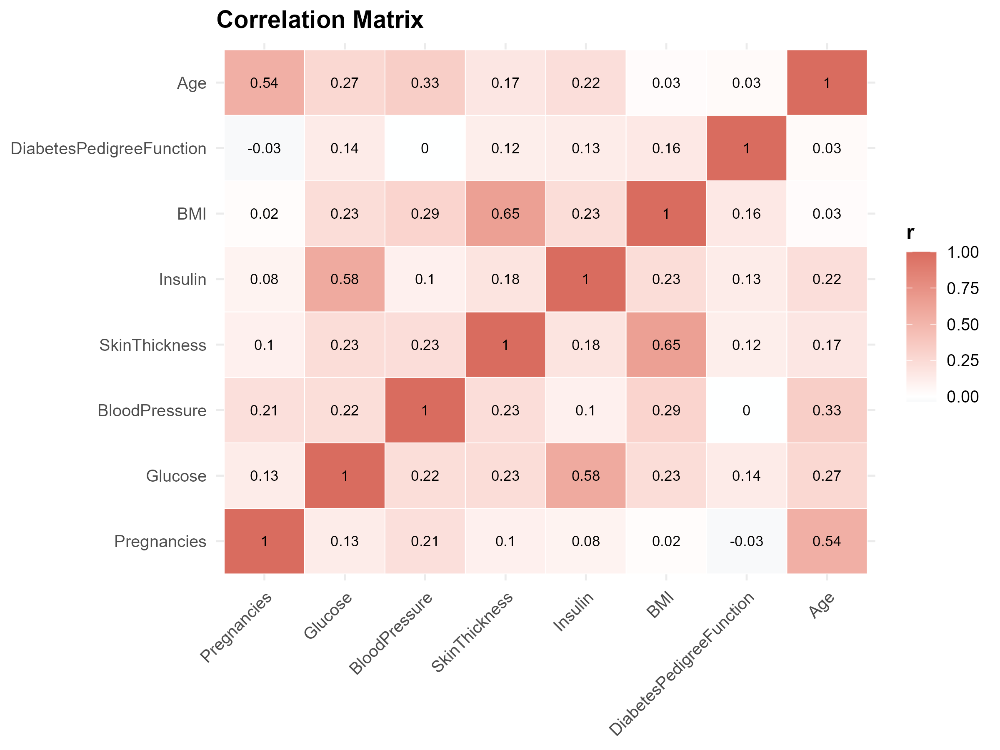

# Diabetes Risk Factor Analysis

*A reproducible R-based statistical analysis of diabetes risk factors using the Pima Indian Diabetes dataset.*

<p align="center">
  <a href="https://github.com/John-JonSteyn/DiabetesRiskFactorAnalysis/stargazers" target="_blank" rel="noopener noreferrer">
    
  </a>
  <a href="https://github.com/John-JonSteyn/DiabetesRiskFactorAnalysis" target="_blank" rel="noopener noreferrer">
    
  </a>
  <a href="https://github.com/John-JonSteyn/DiabetesRiskFactorAnalysis/commits/main" target="_blank" rel="noopener noreferrer">
    
  </a>
  <a href="https://github.com/John-JonSteyn/DiabetesRiskFactorAnalysis/blob/main/LICENSE" target="_blank" rel="noopener noreferrer">
    
  </a>
</p>

---

## Overview

This repository contains a full statistical analysis workflow for the Pima Indian Diabetes dataset in R.

The project covers:

- data inspection and auditing
- cleaning of clinically implausible zero values
- descriptive statistics
- grouped prevalence analysis
- hypothesis testing
- correlation analysis
- multiple linear regression
- logistic regression
- model comparison and evaluation
- automated export of tables, summaries, and plots

The aim is not only to describe the dataset, but to identify which variables show the strongest relationship with diabetes status and glucose levels.

---

## Dataset

## Dataset

The analysis uses the [Pima Indian Diabetes dataset](https://www.kaggle.com/datasets/akshaydattatraykhare/diabetes-dataset), a widely used benchmark dataset containing diagnostic and demographic variables for diabetes research.

Variables included:

- **Pregnancies** - number of times pregnant
- **Glucose** - plasma glucose concentration after 2-hour oral glucose tolerance test
- **BloodPressure** - diastolic blood pressure (mm Hg)
- **SkinThickness** - triceps skin fold thickness (mm)
- **Insulin** - 2-hour serum insulin (mu U/ml)
- **BMI** - body mass index
- **DiabetesPedigreeFunction** - genetic predisposition score
- **Age** - age in years
- **Outcome** - diabetes diagnosis (`0 = no diabetes`, `1 = diabetes`)

---

## Analysis Scope

The script performs the following steps in sequence:

### Data audit
- imports the raw CSV
- checks dimensions, types, variable names, and summary values
- counts missing values and zero values by variable
- exports audit tables

### Data cleaning
- converts clinically implausible zero values to `NA` for:
  - Glucose
  - BloodPressure
  - SkinThickness
  - Insulin
  - BMI

### Descriptive analysis
- computes mean, median, mode, minimum, maximum, range, and standard deviation
- summarises sample composition and diabetes prevalence
- creates grouped variables for:
  - age bands
  - BMI categories
  - pregnancy groups

### Visual analysis
- histograms
- boxplots
- grouped prevalence charts
- outcome comparison plots
- scatter plots
- correlation heatmap
- diagnostic plots for zero counts and outliers

### Inferential analysis
- independent-samples t-tests
- chi-square tests
- one-way ANOVA
- correlation matrix

### Modelling
- multiple linear regression for glucose
- logistic regression for diabetes outcome
- classification metrics:
  - accuracy
  - sensitivity
  - specificity
- manual Hosmer-Lemeshow goodness-of-fit calculation
- interaction testing for `BMI × Age`
- comparison of nested logistic regression models

---

## Key Outputs

The script writes analysis artefacts to two directories:

### `outputs/`
Contains:
- variable audit tables
- cleaned and raw summary tables
- descriptive statistics
- test outputs
- regression coefficients
- model fit summaries
- classification metrics
- a compact `key_results_summary.txt`

### `plots/`
Contains:
- distribution plots
- grouped diabetes-rate charts
- outcome comparison plots
- scatter plots
- correlation heatmap
- linear model diagnostics

---

## Repository Structure

```text
data/
└─ diabetes.csv

outputs/
├─ descriptive_statistics.csv
├─ key_results_summary.txt
├─ linear_model_coefficients.csv
├─ logistic_model_coefficients.csv
├─ logistic_model_odds_ratios.csv
└─ ...

plots/
├─ age_distribution_histogram.png
├─ glucose_by_outcome_boxplot.png
├─ diabetes_rate_by_age_group.png
├─ correlation_matrix_heatmap.png
└─ ...

scripts/
└─ diabetes_analysis.R
```

---

## Selected Visuals

<p align="center">
  
  
</p>

<p align="center">
  
  
</p>

---

## How to Run

Open the repository as an R project or run the script from the repository root.

### Terminal

```bash
Rscript scripts/diabetes_analysis.R
```

### R / RStudio

```bash
source("scripts/diabetes_analysis.R")
```

The script will:

- install required packages if missing
- generate all tables, figures, and model results

---

## License

This project is released under the MIT License. See the `LICENSE` file for details.
